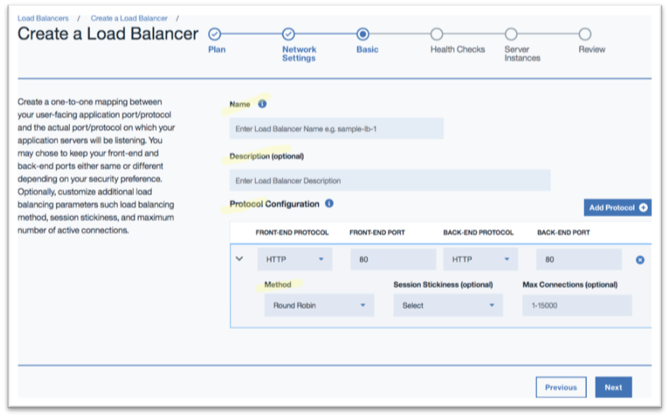
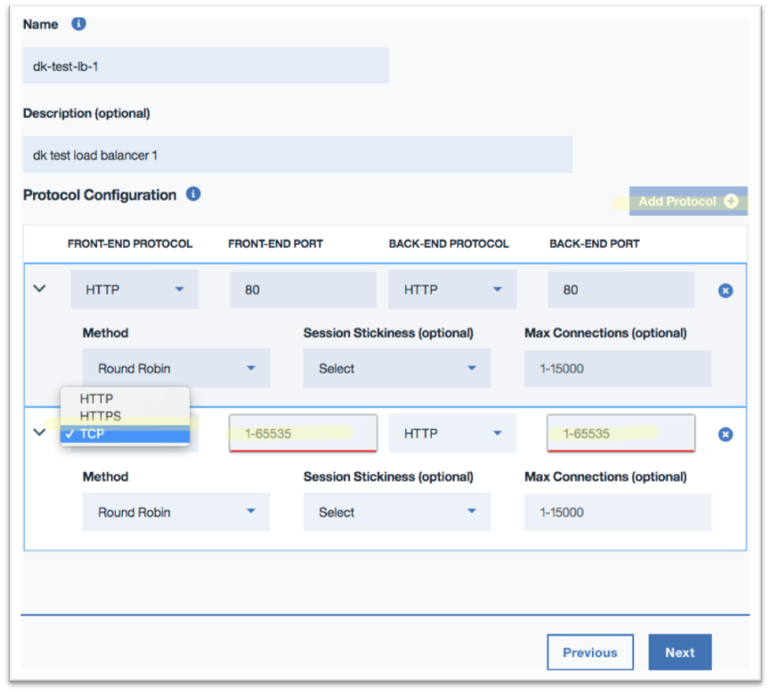
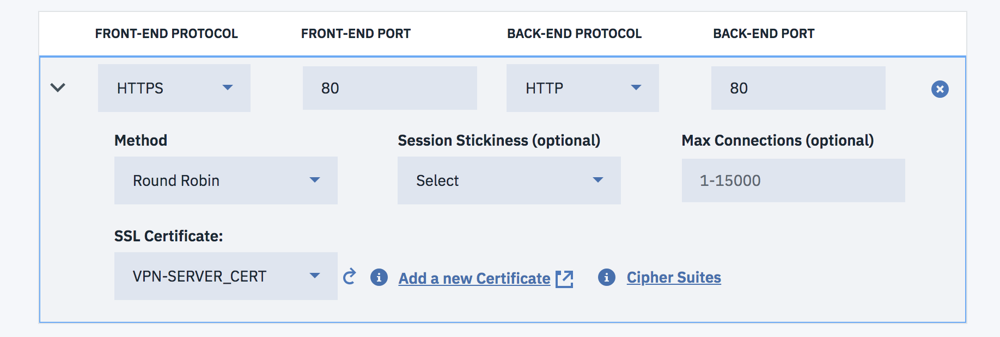
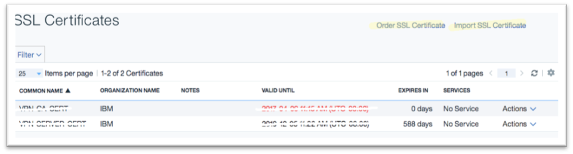
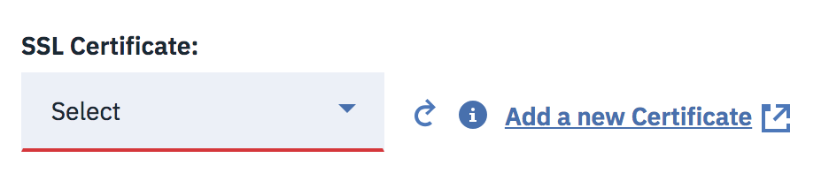
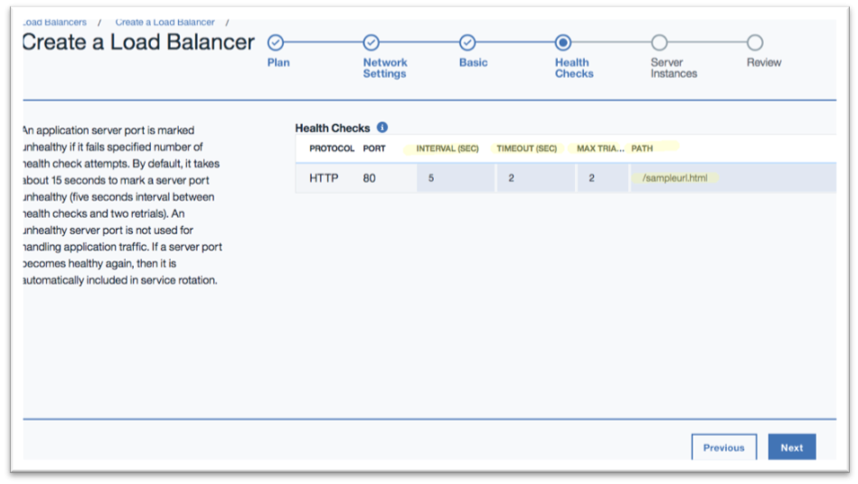

---

copyright:
  years: 2017, 2018
lastupdated: "2018-11-07"

keywords: parameters, load balancing, configure, protocol, health check

subcollection: loadbalancer-service

---

{:shortdesc: .shortdesc}
{:new_window: target="_blank"}
{:codeblock: .codeblock}
{:pre: .pre}
{:screen: .screen}
{:tip: .tip}
{:download: .download}
{:important: .important}
{:note: .note}

# Configuring IBM Cloud Load Balancer parameters
{: #configuring-ibm-cloud-load-balancer-parameters}

Once you create a load balancer, you can then configure it for elastic load balancing. To do so:

1. Name your load balancer, and, optionally, add a description.

	

2. Input the details of your application profile by identifying the protocols and ports your application is listening on. You can use the same configuration for both front-end and back-end, or expose a different front-end port (for security purposes, for instance).

3. The default load balancing method is **Round Robin**. You may change it to **Weighted Round Robin** or **Least Connections** from the drop-down list, depending on your application needs.

4. Optionally, you can enable **Session stickiness**. If enabled, all requests from a given end-user (for example, one with the same source IP) go to the same backend server for a system-defined "sticky" time.

5. You can also set the **Maximum connection limit** against your application.

6. Click **Add Protocol** to specify additional ports and protocols your application may be listening on. Be sure that all front-end ports are unique. You can choose HTTP, HTTPS or TCP as your front-end protocol.

	

	A maximum of two ports may be defined at the time of initial configuration. Additional ports may be added later after creating the service instance. Refer to [Limitations on number of ports](/docs/infrastructure/loadbalancer-service?topic=loadbalancer-service-faqs-for-ibm-cloud-load-balancer#what-s-the-maximum-number-of-virtual-ports-i-can-define-with-my-load-balancer-service-) for more information on the maximum number of ports allowed.
{:note:}

7. The IBM© Cloud Load Balancer terminates incoming HTTPS (HTTP over SSL) connections and can communicate in plain-text HTTP with the back-end application servers, and offloads processor-intensive SSL tasks from your servers if backend protocol is selected as HTTP. If the selected backend protocol is HTTPS, the traffic will be encrypted between load balancer and backend servers. You must upload your SSL Certificate. Select one of your available certificates from the drop-down list.  

	

	If you do not have an existing certificate, then click **Add a new Certificate**. This takes you to an IBM Cloud certificate service where you can either purchase a new certificate or upload an existing one.

	After adding the certificate, return to the load balancer configuration page and click the refresh icon below the SSL Certificate drop-down list to view and add your newly-uploaded certificate.

	

	

	**NOTE: Never delete any certificates associated with HTTPS listeners as this can cause issues with functionality.**

8. Click **Next**.

## Configure Health Checks
The health check definition is mandatory for each of your application ports. These are the back-end ports identified in the previous basic configuration menu.

The system pre-populates a default health check configuration for these back-end ports. You may customize these settings to suit your application needs.

* **Interval**: Interval in seconds between two consecutive health check attempts
* **Timeout**: Maximum amount of time the system will wait for a response against a health check request
* **Max Trials**: Maximum number of additional health check attempts the system will make prior to declaring a port unhealthy
* **Path**: The HTTP URL path for the health check     

Click **Next** to enable your choice.

## What's Next
[Identify your application's resources](/docs/infrastructure/loadbalancer-service?topic=loadbalancer-service-identifying-your-application-server-resources), such as origin pools and health check mechanisms.
