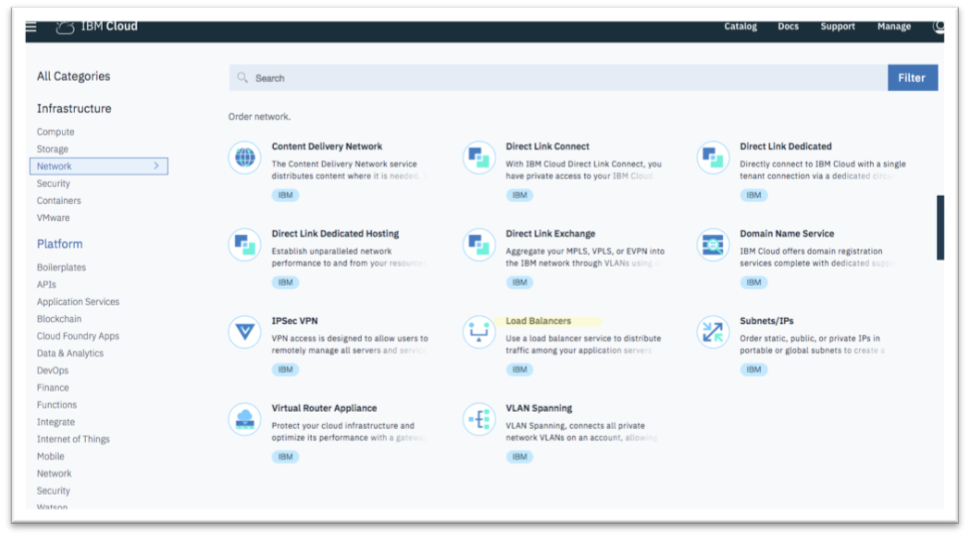
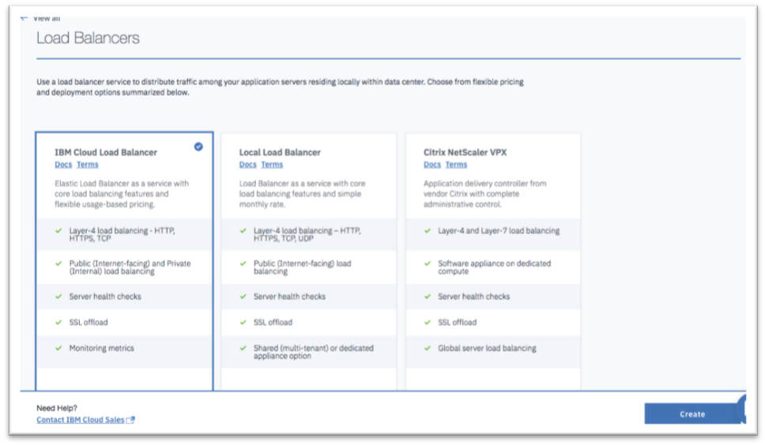
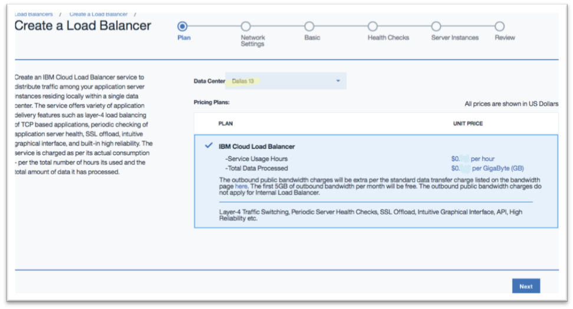
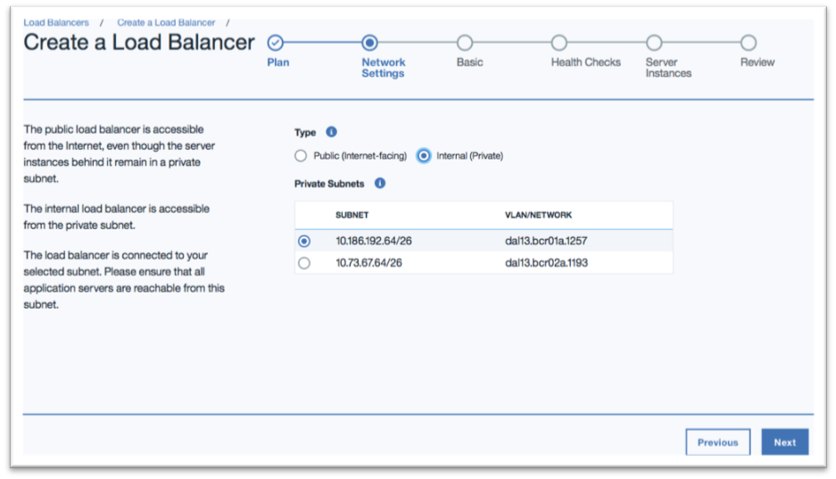

---

copyright:
  years: 2017, 2018
lastupdated: "2018-11-12"

---

{:shortdesc: .shortdesc}
{:codeblock: .codeblock}
{:screen: .screen}
{:new_window: target="_blank"}
{:pre: .pre}
{:table: .aria-labeledby="caption"}

# Create an IBM Cloud Load Balancer
To create an IBM Cloud Load Balancer service, perform the following procedure:

1. From your browser, open the [Customer Portal ](https://control.softlayer.com/){: new_window} and log into your account.

2. Click **Catalog**, and then from the Infrastructure section, navigate to **Network > Load Balancers**.

	

3. Select the **IBM Cloud Load Balancer** (default selection) and click **Create**. 

	If you see **Upgrade** instead of **Create**, then you have to link your IBM Cloud Infrastructure (Softlayer) account by following [these steps ](/docs/account/softlayerlink.html#link_customer_accounts)

	

4. Select your preferred data center from the **Data Center** dropdown, review the information, then click **Next**.

	

5. Specify your load balancer type.

	For Internet-facing applications that need access to the public Internet, select **Public (Internet-facing)**.

	
	
	By default, the Public load balancer receives a globally-unique public IP address from the IBM global address pool. If, however, you wish to assign it public address(es) from your own address pool or wish to deploy it behind a firewall service within your account, check if your public subnet has [sufficient IP addresses](troubleshooting-provisioning.html) and select **Allocate from a public subnet in your account**.

	For internal-only applications that do not need access to the public internet, choose the **Internal (Private)** type.

	

	For both Internet-facing and internal load balancer types, pick one of the private subnets within the account you wish to deploy your load balancer. Your application servers must be reachable from this subnet. If necessary, enable VLAN spanning to ensure the appropriate network connectivity.

	If you do not see any private subnets, click **Previous**, then select a different data center with private subnets.

6. Click **Next** to finish the configuration.

## What's Next
Configure your Load Balancer with [basic parameters](begin-lb-config.html).