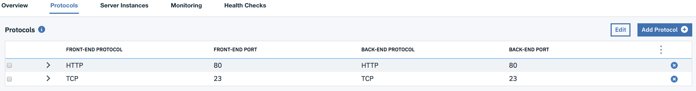
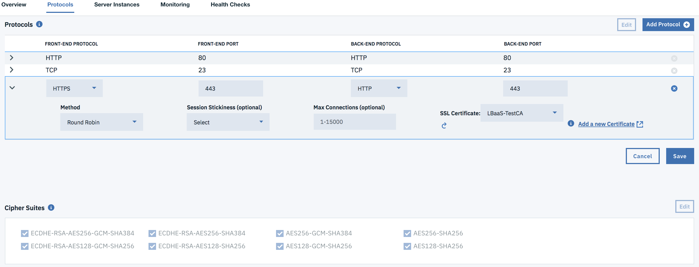
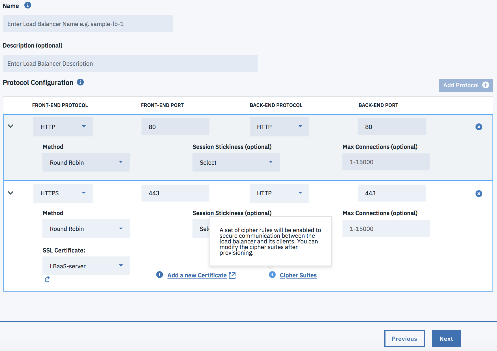

---

copyright:
  years: 2017, 2018
lastupdated: "2018-11-12"

keywords: cipher, suite, https

subcollection: loadbalancer-service

---

{:shortdesc: .shortdesc}
{:new_window: target="_blank"}
{:codeblock: .codeblock}
{:pre: .pre}
{:screen: .screen}
{:tip: .tip}
{:download: .download}

# Choosing a Preferred Cipher Suite for your HTTPS Application
{: #choosing-a-preferred-cipher-suite-for-your-https-application}

Ciphers algorithms that help the IBM© Cloud Load Balancer form secure connections with its HTTP clients.

IBM offers a suite of approved ciphers for you to choose from, so that you secure the communication between your load balancer and your clients.

You can choose a preferred cipher suite for an existing load balancer, or designate them when creating a new one.

## Choosing ciphers for an existing load balancer
To choose a cipher suite configuration for an existing load balancer, navigate to your load balancer screen in the customer portal, and click the Protocols tab. If HTTPS is not selected as your front-end protocol, you will not see the list of cipher suites.

  

Select HTTPS for your front-end protocol, and the available Cipher Suites will display under Load Balancer Details.

  

The Cipher table is editable and allows you to select your desired cipher suites for SSL handshake. Click **Edit**, select the Ciphers you wish to implement, and click **Save**.

**NOTE:** For a list of supported ciphers, refer to [SSL Offload](/docs/infrastructure/loadbalancer-service?topic=loadbalancer-service-ssl-offload-with-ibm-cloud-load-balancer).

## Choosing ciphers when creating a new load balancer

To choose the cipher suite when creating a new load balancer:

1. Follow the instructions to [create a load balancer](/docs/infrastructure/loadbalancer-service?topic=loadbalancer-service-creating-an-ibm-cloud-load-balancer#creating-an-ibm-cloud-load-balancer).

2. Cipher Suite configuration is only applicable with the HTTPS front-end protocol. When you reach the configuration steps for the **Add protocol** section, choose **HTTPS Protocol**.

	

3. A default set of ciphers is alredy selected in the configuration, but you will only be able to edit them once you have finished configuring the load balancer.

	Finish the load balancer configuration, following the instructions in the topic. Once you are done, you can see the default cipher list in the **Protocols Tab** under **Load Balancer Details**.

	

4. The Cipher table is editable and allows you to select your desired cipher suites for SSL handshake. Click **Edit**, select the Ciphers you wish to implement, and click **Save**.

	**NOTE:** For a list of supported ciphers, refer to [SSL Offload](/docs/infrastructure/loadbalancer-service?topic=loadbalancer-service-ssl-offload-with-ibm-cloud-load-balancer).
