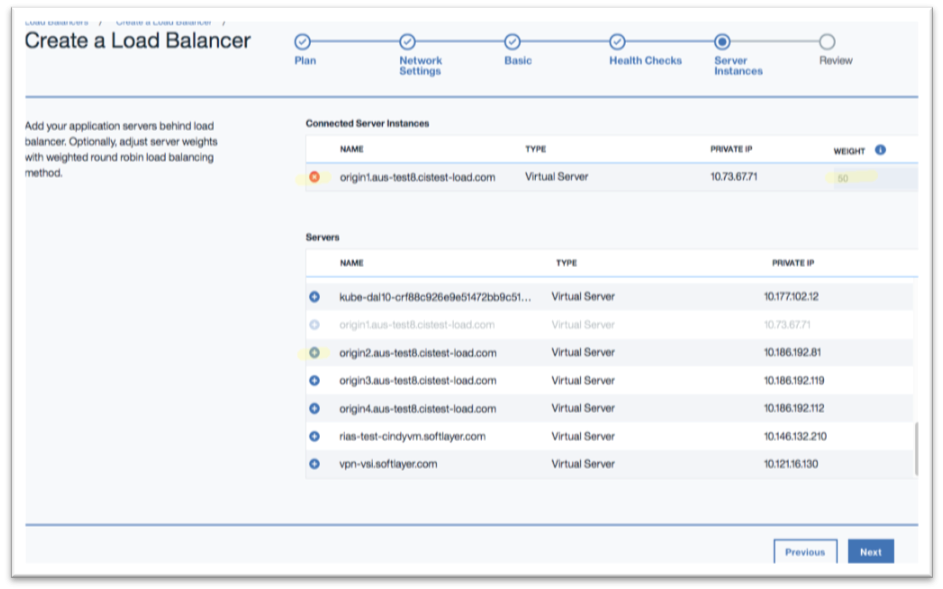

---

copyright:
  years: 2017, 2018
lastupdated: "2018-11-12"

---

{:shortdesc: .shortdesc}
{:codeblock: .codeblock}
{:screen: .screen}
{:new_window: target="_blank"}
{:pre: .pre}
{:table: .aria-labeledby="caption"}

# Identifying Your Application Server Resources
Locate your **server instances** from the table at the bottom and click **+** to add them behind the load balancer. You can select from the IBM© Cloud Virtual Server Instances (VSIs) and Bare Metal Servers in your account.

These server instances must be local to the data center where you deploy the load balancer service. Additionally, server instances from the neighboring data centers within the same city may also be added (for instance, if the first three letters of the data center name are the same).

Click **Next**.

**NOTES:** 

1. Server **weights** are relevant only when using the **Weighted Round Robin** load balancing method. The default weight is 50 and the range is 0-100. The weights are greyed out with other load balancing methods.
2. Refer to [Limitations on number of application servers](/docs/infrastructure/loadbalancer-service?topic=loadbalancer-service-faqs-for-ibm-cloud-load-balancer#what-s-the-maximum-number-of-compute-instances-i-can-associate-with-my-load-balancer-) for more information on the maximum limit for the number of application servers.

## What's Next
[Review the contents](/docs/infrastructure/loadbalancer-service?topic=loadbalancer-service-review-and-place-your-order) of your order before placing it.
