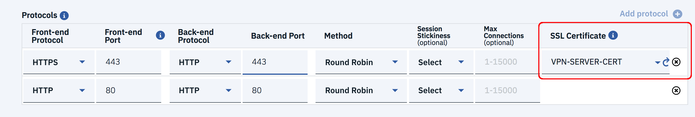

---

copyright:
  years: 2017, 2018
lastupdated: "2020-08-19"

keywords: resources, server, application, instance, configure

subcollection: loadbalancer-service

---

{:shortdesc: .shortdesc}
{:new_window: target="_blank"}
{:codeblock: .codeblock}
{:pre: .pre}
{:screen: .screen}
{:term: .term}
{:tip: .tip}
{:note: .note}
{:important: .important}
{:deprecated: .deprecated}
{:table: .aria-labeledby="caption"}
{:external: target="_blank" .external}
{:table: .aria-labeledby="caption"}
{:generic: data-hd-programlang="generic"}
{:download: .download}
{:DomainName: data-hd-keyref="DomainName"}

# Configuring load-balancing options and placing your order
{: #configure-load-balancing-parameters-and-place-order}

Configure your load balancer and finalize your order.
{: shortdesc}

## Step 1 - Adding protocols

Add the protocols for your load balancer:

1. On the load balancer configuration page, identify the [protocols and ports](/docs/loadbalancer-service?topic=loadbalancer-service-ibm-cloud-load-balancer-basics#front-end-and-back-end-application-ports-protocols) your application is listening on, and then input the details into your new application profile. You can use the same configuration for both front-end and back-end, or expose a different front-end port (for security purposes, for instance).

2. The default [load-balancing method](/docs/loadbalancer-service?topic=loadbalancer-service-load-balancing-methods) is **Round Robin**. You can change it to either **Weighted Round Robin** or **Least Connections** from the list, depending on your application needs.

3. Optionally, you can enable **Session stickiness**, which sends all requests from a user (for example, one with the same source IP) to the same back-end server for a system defined "sticky" time. For more information on session stickiness, see [Session persistence](/docs/loadbalancer-service?topic=loadbalancer-service-advanced-traffic-management-with-ibm-cloud-load-balancer#session-persist)

4. You can also set the **Maximum connection limit** against your application. For more information, see [Max connections](/docs/loadbalancer-service?topic=loadbalancer-service-advanced-traffic-management-with-ibm-cloud-load-balancer#max-connections)

5. Click **Add Protocol** to specify additional ports and protocols your application might be listening on. Be sure that all front-end ports are unique. You can choose HTTP, HTTPS, or TCP as your front-end protocol.

	A maximum of two ports can be defined at the time of initial configuration. Additional ports can be added after creating the service instance. Refer to [Limitations on number of ports](/docs/loadbalancer-service?topic=loadbalancer-service-faqs-for-ibm-cloud-load-balancer#max) for more information on the maximum number of ports allowed.
	{: note}

6. If you chose HTTPS for your front-end protocol, you must upload your SSL Certificate. Select one of your available certificates from the drop-down list.

	The {{site.data.keyword.loadbalancer_full}} [terminates incoming HTTPS](/docs/loadbalancer-service?topic=loadbalancer-service-ssl-offload-with-ibm-cloud-load-balancer) connections and can communicate in plain text HTTP with the back-end application servers when HTTP is selected as the backend protocol. This offloads processor intensive SSL tasks from your servers to the load balancer. You can also choose to have HTTPS as the backend protocol when the backend application servers are configured to receive HTTPS traffic. In this case, traffic is encrypted between the load balancer and the backend servers.

	

	If you do not have an existing certificate, go to the [IBM Cloud Certificate service](https://cloud.ibm.com/classic/security/sslcerts) and either purchase a new certificate or upload an existing one. After adding the certificate, return to the load balancer configuration page and click the refresh icon next to the SSL Certificate drop-down list to view and add your newly added certificate.
	{: note}

	Never delete any certificates associated with HTTPS listeners as this can cause issues with functionality.
	{: important}

## Step 2 - Configuring health checks

The [health check](/docs/loadbalancer-service?topic=loadbalancer-service-performing-health-checks-with-ibm-cloud-load-balancer) definition is mandatory for each of your application ports (the back-end ports that are identified in the protocols section).

The system pre-populates a default health check configuration for these back-end ports, and you can customize these settings to suit your application needs:

* **Interval**: Interval in seconds between two consecutive health check attempts
* **Timeout**: Maximum amount of time the system waits for a response against a health check request
* **Max Trials**: Maximum number of additional health check attempts the system makes before declaring a port unhealthy
* **Path**: The HTTP URL path for the health check

## Step 3 - Adding server instances

Select your **server instance** from the dropdown in the table, and use the **Attach Server** button to add more servers. You can select from the IBM© Cloud Virtual Server Instances (VSIs) and Bare Metal Servers in your account.

These server instances must be local to the data center where you deploy the load balancer service. Additionally, server instances from the neighboring data centers within the same city can also be added (for instance, if the first three letters of the data center name are the same).

If the load balancer type is Public to Public, the server instances are added with their Public IP, as shown in the following image.

Server **weights** are relevant only when using the **Weighted Round Robin** load-balancing method. The default weight is 50 and the range is 0-100. The weights are disabled with other load-balancing methods.
{: note}

Refer to [Limitations on number of application servers](/docs/loadbalancer-service?topic=loadbalancer-service-faqs-for-ibm-cloud-load-balancer#what-s-the-maximum-number-of-compute-instances-i-can-associate-with-my-load-balancer-) for more information on the maximum limit for the number of application servers.
{: tip}

## Step 4 - Placing your order

Finally, to place your order:

1. Review the Order Information in the right column of the page.

2. Click the checkbox after reading the Master Service Agreement.

3. Click **Create**.

	The system creates your load balancer and takes you to the Load Balancers summary page. Refresh your browser window to see the entry for your new load balancer and its state change from offline to online, which usually takes a few minutes. Offline load balancers are disabled, while online load balancers can be clicked to manage and monitor them, as shown in the following image.

	

## What's next
{: #what-s-next-3}

[Managing and monitoring your service](/docs/loadbalancer-service?topic=loadbalancer-service-monitoring-and-managing-your-service) to edit configuration and monitor service performance.
