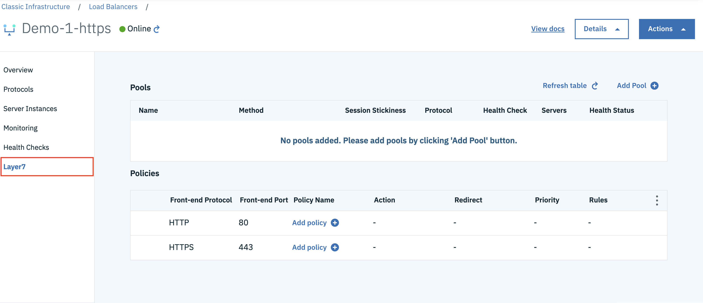

---

copyright:
  years: 2017, 2018, 2019
lastupdated: "2019-07-01"

keywords: l7, layer 7, policies, rules, pools

subcollection: loadbalancer-service

---

{:shortdesc: .shortdesc}
{:new_window: target="_blank"}
{:codeblock: .codeblock}
{:pre: .pre}
{:screen: .screen}
{:tip: .tip}
{:note: .note}
{:important: .important}
{:download: .download}

# Layer-7 Load Balancing
{: #layer-7-load-balancing}

The IBM© Cloud Load Balancer Service distributes traffic among multiple server instances, including bare-metal and virtual-server instances, using Layer-7 (application layer) data.

 * The data traffic to be distributed is classified using policies and rules.
 * Policies define what action to take when the data traffic matches all the rules associated with a policy.
 * Layer-7 (L7) load balancing is supported for HTTP and HTTPS traffic only.

 

## Layer-7 Policies and Rules
{: #layer-7-policies-and-rules}
A Layer-7 policy is associated with a front-end application port. Multiple policies can be associated with a front-end port.

 * These policies are evaluated in order, based on the priority assigned to each policy.
 * An associated action is taken when the policy is matched.
 * Each L7 rule is associated with a policy.
 * If all the rules associated with the policy evaluate to `true`, the policy is matched, so the associated action is taken.

Refer to [L7 Policy and Rules](/docs/infrastructure/loadbalancer-service?topic=loadbalancer-service-layer-7-policy) for additional details.

## Layer-7 Pools
{: #layer-7-pools}
Each Layer-7 load balancer pool contains one or more logical server instances.

 * Each logical server instance is identified by an IP address and port number.
 * Each pool has a health monitor associated with it, which monitors the health of all the servers in the pool.
 * A pool can be configured for session persistence.
 * Use the source IP address of the client to configure session persistence.

Refer to [L7 Pools](/docs/infrastructure/loadbalancer-service?topic=loadbalancer-service-layer-7-pool) for additional details.
