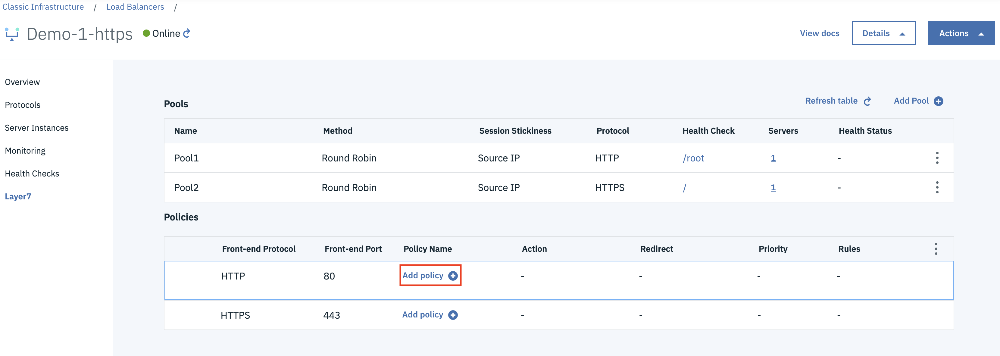
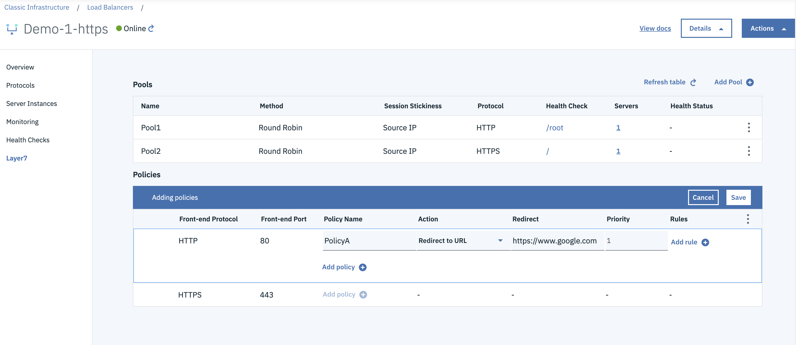

---

copyright:
  years: 2017, 2019
lastupdated: "2019-07-01"

keywords: layer 7 policy

subcollection: loadbalancer-service

---

{{site.data.keyword.attribute-definition-list}}

# Layer 7 policy
{: #layer-7-policy}

A Layer 7 (L7) policy is used to classify traffic by matching its L7 information with L7 rules, and then taking specific actions if those rules match.

* A policy is applied to a front-end application port (protocol).
* Multiple policies can be applied to the same protocol.

Since multiple policies can be applied to a protocol, a priority is associated with each policy.

* Policies with the lowest set priority are evaluated first.
* If the rules associated with the policy do not match the traffic, the next lowest policy on the priority list is evaluated.

If the traffic does not match any of the policy rules, the traffic is redirected to a default pool, which is the pool that was configured when the basic load balancer was deployed.

{: caption="Layer 7 policy" caption-side="bottom"}

{: caption="Layer 7 details" caption-side="bottom"}

Each policy is associated with an action that runs when all rules in the policy match the traffic.

The actions can be:

- Reject
- Redirect to HTTPS
- Redirect to URL
- Redirect to pool

Policies set to `reject` are evaluated first.

If the action is set to `REDIRECT_HTTPS`, then the HTTP traffic redirects to the HTTPS listener port. Only one configuration of this action is supported per listener. This action cannot configure L7 rules, and you must configure it using the API. You can configure the L7 policy by using the action `REDIRECT_HTTPS` with the `addL7Policies` method of the  `SoftLayer_Network_LBaaS_L7Policy` service. A `redirectUrl` data type provides the HTTPS listener's universally unique identifier (UUID) for HTTPS redirection.

The `Redirect to https` policy is evaluated after a `Reject`. If this policy exists, then any existing `Redirect to url` and `Redirect to pool` policies do not apply. Also, if there are any existing `Redirect to https` policies, then you cannot create any new `Redirect to url` and `Redirect to pool` policies.

If no HTTPS redirect policy exists, then any policies set to `Redirect to url` are evaluated after `Reject`.

Finally, policies set to `Redirect to pool` are evaluated last.

Within each action category, policies are evaluated in ascending order of priority (lowest to highest). Only one action of `REDIRECT_HTTPS` is allowed per listener, and it takes precedence over all other policies except `REJECT`. As a result, the concept of "priority" does not apply.

## Layer 7 policy properties
{: #layer-7-policy-properties}

Property  | Description
------------- | -------------
Name | The name of the policy. Each policy must have a unique name.
Action | The action to take when the rules match. The actions are `REJECT`, `REDIRECT_HTTPS`, `REDIRECT_URL`, and `REDIRECT_POOL`. `REDIRECT_HTTPS` action is supported by API only.
Priority | Within each action category, policies are evaluated in ascending order of priority. This field is not applicable for `REDIRECT_HTTPS` because only one such action is applicable per listener.
Redirect URL | The URL to which traffic is redirected, if the action is set to `REDIRECT_URL`. Also, the HTTPS listener UUID to which traffic is to be redirected, if the action is set to `REDIRECT_HTTPS`.
Redirect L7 Pool | The pool of servers to which traffic is sent, if the action is set to `REDIRECT_POOL`.
Protocol | The front-end application port to which the policy is applied.

## Layer 7 rule
{: #layer-7-rule}

Layer 7 rules define a portion of the incoming traffic that is to be matched with specific values.

* Adding L7 rules is not allowed for any L7 policy with `REDIRECT_HTTPS` action.
* If the incoming traffic matches the specified value of a rule, then the rule evaluates to `true`.
* Layer 7 rules are always associated with a Layer 7 policy. Multiple Layer 7 rules can be associated with the same Layer 7 policy.
* If multiple rules are associated with a policy, then each rule is evaluated to be `true` or `false`.
* If all the rules that are associated to a policy evaluate to `true`, then the policy action is applied to the request. Otherwise, the load balancer evaluates the next policy.

Rules have types, which indicate the portion of the Layer 7 traffic to be matched with the rule.

Type      |  Field to be extracted and evaluated
----------| -----------------------
`HOST_NAME` | The hostname part of the URL (for example, `api.my_company.com`)
`FILE_TYPE` | The end of the URL, representing the file type (for example, `jpg`)
`HEADER`    | A field in the HTTP header
`COOKIE`    | A named cookie in the HTTP header
`PATH`      | The part of the URL that follows the hostname (for example, `/index.html`)

Rules also have a comparison type, which indicates how they are to be evaluated.

Comparison Type |  Type of evaluation
----------------|---------------------
`REGEX`           |  Match the extracted field (for example, `hostname`) with the supplied regular expression
`STARTS_WITH`     |  Verify whether the extracted field starts with the supplied string
`ENDS_WITH`       |  Verify whether the extracted field ends with the supplied string
`CONTAINS`        |  Verify whether the extracted field contains the supplied string
`EQUAL_TO`        |  Verify whether the extracted field is identical to the supplied string

Not all rule types support all comparison types. For example, if you are using `FILE_TYPE`, it is best to use comparison types `REGEX` and `ENDS_WITH`.
{: tip}

## Layer 7 rule properties
{: #layer-7-rule-properties}

Property  | Description
------------- | -------------
Type | Specifies the type of rule. Rule types can be `HOST_NAME`, `FILE_TYPE`, `HEADER`, `COOKIE`, or `PATH`.
Comparison Type | Comparison types are used in association with the rule type, key, and value to define a rule and classify traffic. Comparison types can be: `REGEX`, `STARTS_WITH`, `ENDS_WITH`, `CONTAINS`, and `EQUAL_TO`.
Key | The description key for the rule types `HEADER` and `COOKIE`.
Value |  For the rule types `HEADER` and `COOKIE`, the value is compared against the key.
Invert | If you set the value to 1, the value of this L7 rule comparison is set to `true` whenever the specified rule is not matched.
Layer 7 Policy ID | The unique identifier of the policy to which the rules are attached.
