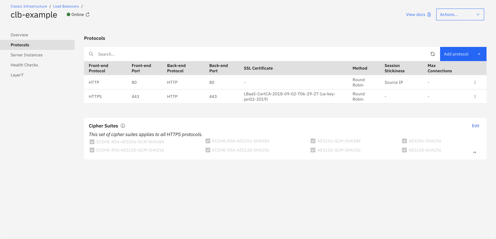
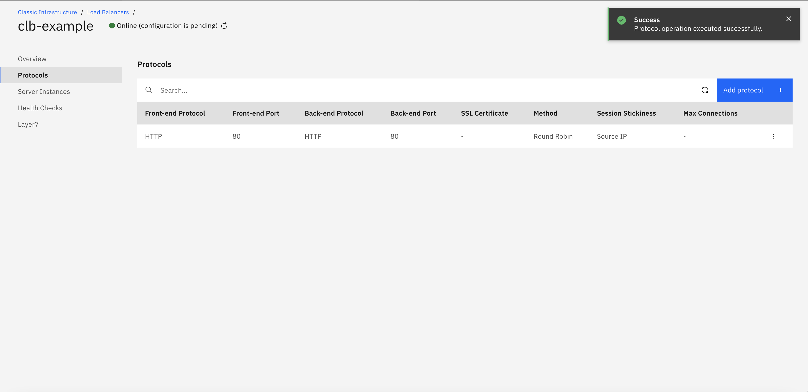

---

copyright:
  years: 2017, 2018
lastupdated: "2018-11-12"

keywords: l7, layer 7, monitor, manage, service

subcollection: loadbalancer-service

---

{:shortdesc: .shortdesc}
{:codeblock: .codeblock}
{:screen: .screen}
{:new_window: target="_blank_"}
{:pre: .pre}
{:table: .aria-labeledby="caption"}
{:note: .note}
{:important: .important}
{:tip: .tip}

# Monitoring and managing your service
{: #monitoring-and-managing-your-service}

You can edit your configuration or monitor your service performance by clicking on the load balancer name in the load balancer summary page.

The **fully-qualified domain name (FQDN) address** of your load balancer instance can be seen by clicking on the **Details** button. Your end-users are able to connect to your application using this FQDN address.

The public and private IP address(es) of the load balancer service are not exposed to the outside world; only the FQDN address is exposed.
{: note}

The **Details** dropdown also displays the type, location and logging enablement of the load balancer.

The **Overview** tab on the left side of the screen provides high-level information about your service. It displays the current health of your application servers and their ports, and also provides a quick summary of system performance - throughput, connection rate, concurrent connections, and so on.

You can select the **Monitoring** tab to view real-time charts of your system performance. These graphs may be viewed per individual application port and for various time durations.

You can edit your existing configuration using the **Protocols**, **Server Instances**, and **Health Checks** tabs. For example, the **Protocols** tab can be used to define additional application ports or to customize the SSL cipher lists when there is an existing HTTPS protocol.

After every configuration change, the load balancer goes into an UPDATE PENDING state. In this state, datapath traffic is not affected, but no further updates can be made to that load balancer. Click the refresh button next to the load balancer's state to check the latest status.

You can also use the **Layer7** tab to configure [Layer-7 Load Balancing](/docs/loadbalancer-service?topic=loadbalancer-service-layer-7-load-balancing).
