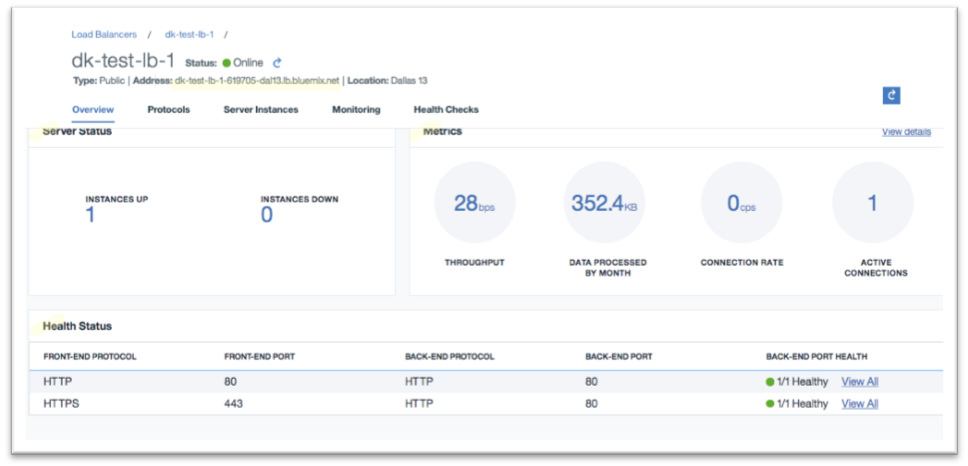
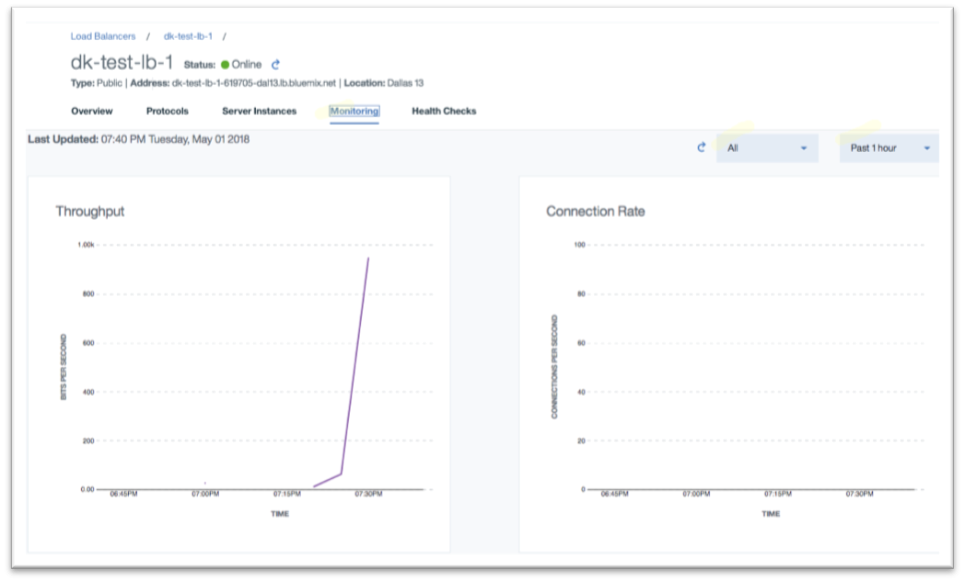
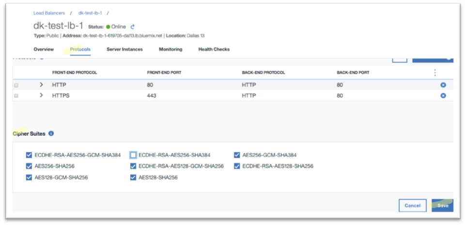

---

copyright:
  years: 2017, 2018
lastupdated: "2018-11-12"

keywords: l7, layer 7, monitor, manage, service

subcollection: loadbalancer-service

---

{:shortdesc: .shortdesc}
{:codeblock: .codeblock}
{:screen: .screen}
{:new_window: target="_blank"}
{:pre: .pre}
{:table: .aria-labeledby="caption"}
{:note: .note}
{:important: .important}
{:tip: .tip}

# Monitoring and Managing Your Service
{: #monitoring-and-managing-your-service}

You may edit your configuration or monitor your service performance by clicking service name URL on the load balancer summary page.

The **fully-qualified domain name (FQDN) address** of your load balancer service instance can be seen just below the service name. Your end-users are able to connect to your application via this FQDN address. Note that the public and private IP address(es) of the load balancer service are not exposed to the outside world; only the FQDN address is exposed.

The **Overview** tab provides high-level state information of your service. It displays the current health of your application servers and their ports. It also provides a quick summary of system performance - throughput, connection rate, concurrent connections etc.

Navigate to the **Monitoring** tab to view real-time charts of your system performance. These graphs may be viewed per individual application port and for various time durations.

You may edit your existing configuration by navigating to **Protocols**, **Server Instances**, and **Health Checks** tabs. As an example, navigate to Protocols tab to define additional application ports or to customize SSL cipher list.

