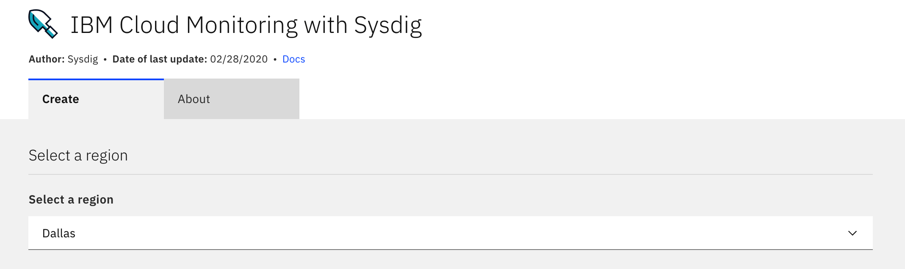
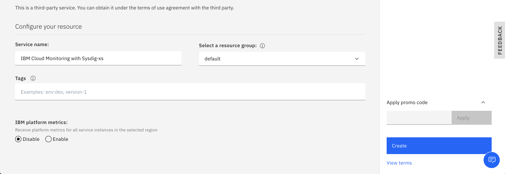

---

copyright:
  years: 2017, 2020
lastupdated: "2020-04-06"

keywords: monitor metrics

subcollection: loadbalancer-service

---

{{site.data.keyword.attribute-definition-list}}

# Monitoring metrics using IBM Cloud Monitoring
{: #monitoring-metrics}

Support for the IBM Cloud Monitoring service ended 31 March 2020. {{site.data.keyword.loadbalancer_full}} monitoring is now provided with {{site.data.keyword.mon_full_notm}}, a third-party monitoring tool that specializes in data aggregation, usage alerts, and in-depth visualizations. For more information, see [{{site.data.keyword.mon_full_notm}}](https://www.ibm.com/cloud/sysdig).
{: shortdesc}

Load balancers calculate the metrics and send those metrics to your {{site.data.keyword.mon_full_notm}} instance, which reflects different types of use and traffic. You can visualize and analyze metrics from either the {{site.data.keyword.mon_full_notm}} dashboard, or its API.

## Metrics available by service plan
{: #metrics-by-plan}

The supported monitoring metrics include:

* Active connections to your load balancer at a given time.
* Throughput of data passing through your load balancer over a given time.
* Connection rate, or an analysis of when more or less connections are made to your load balancer.

These metrics help track the traffic and usage patterns for your load balancers and can provide insight about peak traffic hours, usage dropoffs, and overall usage patterns.

Each metric is composed of the following metadata types:

* Metric name - The name for the collected metric.
* Metric type - Determines whether the metric value is a counter metric or a gauge metric. Each of these metrics is of the type `gauge`, which represents a single numerical value that can arbitrarily fluctuate over time.
* Value type - A unit of measurement for a specific metric. Examples include bytes or counts. A value type of `none` means that the metric value represents individual occurrences of that metric type.
* Segment - How you want {{site.data.keyword.mon_full_notm}} to divide and display the monitoring metrics.

### Active connections
{: #ibm_cloud_load_balancer_active_connections}

Active connections are the number of connections that are established on a load balancer at a specific time.

The active connection metric contains the following metadata:

| Metadata | Description |
|----------|-------------|
| Metric name | `ibm_cloud_load_balancer_active_connections` |
| Metric type | `gauge` |
| Value type | `none`  |
| Segment by | `IBM Cloud Load Balancer appliance metrics` and `IBM Cloud Load Balancer listener metrics` |
{: caption="Table 1: IBM Cloud Load Balancer active connections metrics metadata" caption-side="bottom"}


### Connection rate
{: #ibm_cloud_load_balancer_connection_rate}

Connection rate is number of new incoming active connections per second to your load balancer.

| Metadata | Description |
|----------|-------------|
| Metric name | `ibm_cloud_load_balancer_connection_rate`|
| Metric type | `gauge` |
| Value type  | `none` |
| Segment by | `IBM Cloud Load Balancer appliance metrics` and `IBM Cloud Load Balancer listener metrics` |
{: caption="Table 2: IBM Cloud Load Balancer connection rate metric metadata" caption-side="bottom"}

### Throughput
{: #ibm_cloud_load_balancer_throughput}

Throughput is the amount of data that passes in and out of a load balancer over a period of time.

| Metadata | Description |
|----------|-------------|
| Metric name | `ibm_cloud_load_balancer_throughput`|
| Metric type | `gauge` |
| Value type  | `byte` |
| Segment by | `IBM Cloud Load Balancer appliance metrics` or `IBM Cloud Load Balancer listener metrics` |
{: caption="Table 3: IBM Cloud Load Balancer throughput metric metadata" caption-side="bottom"}

## Metric segmentation
{: #attributes}

You can split the data that {{site.data.keyword.mon_full_notm}} presents into various visualizations in the {{site.data.keyword.mon_full_notm}} dashboard, allowing views of different metrics based on your preferences. For example, if you have multiple load balancers or accounts with different load balancers in each account, you might want to focus on a particular listener (front-end protocol) port.

As an example, you can segment the `active connections` by `IBM Cloud Load Balancer listener port` to show how many active users are connected to the load balancer through each listener type. To illustrate this, let's assume that your load balancer has two different listener protocols one HTTP on port 80 and another for TCP on port 8080. The dashboard would contain different lines showing 10 users who are connected through HTTP on Port 80 in one color, and 6 users connected through TCP on port 8080 in another color.

### Global attributes
{: #global-attributes}

The following attributes are available for segmenting all three of the {{site.data.keyword.mon_full_notm}} metrics.

| Attribute | Attribute Name | Attribute Description |
|-----------|----------------|-----------------------|
| `Resource` | `ibm_resource` | A load balancer's unique ID |
| `Scope` | `ibm_scope` | The account that is associated with a given load balancer |
| `Service name` | `ibm_service_name` | ibm-cloud-load-balancer |
{: caption="Table 4: {{site.data.keyword.mon_full_notm}} global attributes" caption-side="bottom"}

### Additional attributes
{: #additional-attributes}

The following attributes are available to segment one or more of the global attributes. See the individual metrics for any segmentation options.

| Attribute | Attribute Name | Attribute Description |
|-----------|----------------|-----------------------|
| IBM Cloud Load Balancer appliance metrics | `ibm_cloud_load_balancer_appliance_ip` | The metrics coming from the load balancer back end. Because the load balancer is highly available, multiple appliances support each load balancer for redundancy.  |
| IBM Cloud Load Balancer listener metrics | `ibm_cloud_load_balancer_listener_port` | The metrics that are gathered from individual listeners and their ports. Configure the listeners in your load balancer settings. The monitoring metrics reflect the metrics coming from those listeners. |
{: caption="Table 5: {{site.data.keyword.mon_full_notm}} additional attributes" caption-side="bottom"}

The displayed metrics contain a timestamp and the metric value for the time interval ending at that timestamp. You can specify different scopes, as well as the time interval over which to report the metrics.

The supported protocols include:

* HTTP
* HTTPS
* TCP

Specifying a listener port filters the metric by that listener. For example, if you don't specify a port, and the metric is `Throughput`, then {{site.data.keyword.mon_full_notm}} reports the total throughput for all listener protocols. However, if the listener protocol is HTTP on port 80, then {{site.data.keyword.mon_full_notm}} reports the throughput for HTTP traffic only.

You can also specify the time interval over which to report your metrics. Time intervals that are supported in the {{site.data.keyword.mon_full_notm}} dashboard are:

* 10 seconds
* 1 minute
* 10 minutes
* 1 hour
* 6 hours
* 2 weeks
* Custom  

The number of data points you can report is roughly the same for each time interval. For example, if the interval is 1 hour, then each data point represents 5 minutes of data. If the interval is 2 weeks, then each data point represents 24 hours of data.

## Enabling metrics monitoring
{: #enable-metrics-monitoring}

To receive monitoring metrics, you must set up your {{site.data.keyword.mon_full_notm}} instance.

To do so, follow these steps:

1. Navigate to the [metrics monitoring portal](https://cloud.ibm.com/observe/monitoring), then click **Create a monitoring instance**.

2. Select a region for your {{site.data.keyword.mon_full_notm}} instance.

   If you do not have an existing load balancer, see [Using an elastic IBM Cloud Load Balancer for server load balancing](/docs/loadbalancer-service?topic=loadbalancer-service-creating-and-using-an-ibm-cloud-load-balancer-for-elastic-server-load-balancing) to provision one.
   {: tip}

   {: caption="Region" caption-side="bottom"}

   The region must match the location of your existing load balancer.
   {: important}

3. Choose your pricing plan.

   Pricing plan details are explained in the selection window. Select the plan that best meets your requirements.

4. Provide a service name for your instance. It can be any name that you want, and has no impact on functionality.

   Do not create multiple {{site.data.keyword.mon_full_notm}} instances with the same name.
   {: important}

5. Optionally, select a resource group. A resource group is a way to organize account resources in customizable groupings. Any account resource that is managed by using IBM Cloud Identity and Access Management (IAM) access control belongs to a resource group within your account.

   {: caption="Resource group" caption-side="bottom"}

   If you do not have any pre-configured resource groups, or no reason to share this resource selectively, use the default selection.
   {: note}

   If your account has multiple resource groups, you can choose which one has access to this {{site.data.keyword.mon_full_notm}} instance. This allows you to have metrics available to some resource groups and not to others.
   {: tip}

6. Select the **Enable Platform Metrics** checkbox. You must select this to receive metrics from your load balancer.

7. Click **Create**. You are taken back to the monitoring metrics home page.

Within a few minutes, your new instance displays. You might have to refresh your browser to see it.

## Working with the {{site.data.keyword.mon_full_notm}} dashboard
{: #working-with-sysdig-dashboard}

To view and work with your {{site.data.keyword.mon_full_notm}} metrics, follow these steps:

1. Navigate to the [metrics monitoring portal](https://cloud.ibm.com/observe/monitoring).

2. Click **View {{site.data.keyword.mon_full_notm}}** next to the service name of the {{site.data.keyword.mon_full_notm}} instance you want to work with.

   The first time that you access your {{site.data.keyword.mon_full_notm}} instance, several windows display as part of the internal setup. Leave these selections with their default entries, and click through the pages until you reach the {{site.data.keyword.mon_full_notm}} main page.
   {: note}

3. Select **Dashboards** on the left sidebar to open the IBM Load Balancer Monitoring Metrics dashboard. Then, click **Default Dashboards > IBM > Load Balancer Monitoring Metrics**. The default dashboard is not editable.

4. Three main metrics in the dashboard are shown: Throughput, Active Connections, and Connection Rate. To modify options and segment your metrics by load balancer ID or listener port, you must create a custom dashboard.

   ){: caption="{{site.data.keyword.mon_full_notm}} dashboard" caption-side="bottom"}

   You can choose what time window that you'd like to see your metrics by using the time selection bar. You can also zoom in and out for more granularity and drag the mouse to create a selection of a specific time window.
   {: tip}

## Creating a custom metrics dashboard
{: #create-custom-metrics-dashboard}

You can create your own dashboard to customize your monitoring metrics, such as viewing information about particular load balancers, or seeing only traffic that comes through HTTPS listeners.

To customize your dashboard, follow these steps:

1. Navigate to the [metrics monitoring portal](https://cloud.ibm.com/observe/monitoring).

2. Click **View {{site.data.keyword.mon_full_notm}}** next to the service name of the {{site.data.keyword.mon_full_notm}} instance you want to work with. The dashboard opens.

3. On the left sidebar, select **Dashboards**. Then, click the green **+** sign in the pane.

   {: caption="Add dashboard" caption-side="bottom"}

4. Select **Blank dashboard**, then select the type of visual representation you want.

   {{site.data.keyword.mon_full_notm}} offers eight different visualizations for your dashboard. Read the description for each visualization, then choose the one that best meets your requirements.

   **Line** ("View trends over time") is the easiest and most basic option. It is also the most frequently selected option. The following examples show a Line-based visualization.
   {: note}

5. Configure your custom dashboard.

   * In the **Metrics** field, enter `ibm_cloud` to display the IBM {{site.data.keyword.mon_full_notm}} load balancer metrics. The ones discussed so far in this topic are `ibm_cloud_load_balancer_active_connections`, `ibm_cloud_load_balancer_connection_rate`, and `ibm_cloud_load_balancer_throughput`. After you click and add each metric, a new dropdown menu appears to select the next one. Repeat this process until you added all three.

   You can monitor listener port traffic by enabling the `ibm_cloud_load_balancer_listener_port` metric.
   {: tip}

   * You can choose a scope to display in your dashboard by clicking **Override Dashboard Scope**. For example, you can display the metrics for a particular load balancer.

   * You can also set a segment to compare metrics across the scope you defined. For example, you can look at throughput for a particular load balancer segmented by listener port.

6. Click **Save** for your new custom dashboard to be accessible.

   By default, the dashboard begins with the name "blank dashboard". You can change the name by selecting **Dashboards** from the sidebar, then clicking the Pencil icon next to the name.
   {: tip}

To return to the default {{site.data.keyword.mon_full_notm}} dashboard at any time, select **Dashboards > Default Dashboards > IBM > Load Balancer Monitoring Metrics**.

## Working with {{site.data.keyword.mon_full_notm}} using the APIs
{: #metric-query-api}

You can also work with the {{site.data.keyword.mon_full_notm}} instance by using the metric query API. You might want to do this if you need raw data points or want to consume your metrics from a command-line interface rather than using the {{site.data.keyword.mon_full_notm}} dashboard.

After you create your I{{site.data.keyword.mon_full_notm}} instance, you must collect the following two pieces of information.

* The {{site.data.keyword.mon_full_notm}} Monitor API token
* The endpoint of your IBM Cloud Monitoring {{site.data.keyword.mon_full_notm}} instance

To collect this information and start working with your {{site.data.keyword.mon_full_notm}} instance using the metric query API, follow these steps:

1. Access the [Monitoring home page](https://cloud.ibm.com/observe/monitoring), and click **View {{site.data.keyword.mon_full_notm}}** next to the instance you want to work with. After the {{site.data.keyword.mon_full_notm}} dashboard shows, select your Account Profile icon on the left sidebar, then select **Settings**. Your account settings display.

   {: caption="Settings" caption-side="bottom"}

2. Your API token is an alphanumeric string that is located in the **{{site.data.keyword.mon_full_notm}} Monitor API Token** field. Click the **Copy** button to the right of the key to transfer it to your clipboard.

   Do not share this key. Anyone who has this key has full access to your metrics.
   {: important}

3. To get the endpoint of your {{site.data.keyword.mon_full_notm}} instance, navigate to your main {{site.data.keyword.mon_full_notm}} dashboard in your browser. Then, select the URL to the dashboard, which appears similar to:

   ```sh
   https://us-south.monitoring.cloud.ibm.com/#/default-dashboard/ibm_cloud_load_balancer?last=3600
   ```

   The first part of the URL (in this case, `us-south.monitoring.cloud.ibm.com`) is your endpoint. Make note of it.

4. After you have both the API token and the endpoint, you can format your POST request. The following POST request is an example, with all the options that you can modify. These options are:

   * The {{site.data.keyword.mon_full_notm}} Monitor API token.
   * The endpoint of your {{site.data.keyword.mon_full_notm}} instance.
   * The value for `ibm_resource` (this is the load balancer ID you want to see metrics for).

      If you want to see this metric for all of your load balancers, do not enter a value for the `scope` attribute. For example, use `"scope” : ""`.
      {: tip}

   * The metric type that you want to see the results for. This example uses `ibm_cloud_load_balancer_throughput`, but `ibm_cloud_load_balancer_active_connections` and `ibm_cloud_load_balancer_connection_rate` are also valid options.
   * The `from` and `to` attributes define the times to focus the scan, set in Epoch Time and in microseconds.
   * The `sampling` and `value` attributes set the granularity of which data is returned in the POST request.

      Because a large volume of data is stored in {{site.data.keyword.mon_full_notm}}, choosing the specific level of granularity is important. {{site.data.keyword.mon_full_notm}} can return only 600 data points at any time with a given request. As a result, the `sampling` and `value` attributes are important. Leaving these two lines out of your request returns an aggregate sum over that time period instead.

      If the time range specified by `from` and `to` is large (for example, 4 days), but you define a `sampling` and `value` of 10 seconds, this means that you receive 4 days worth of data that is split into 10-second chunks. This is not a useful sampling due to the large amount of data returned. Specifying a larger chunk is recommended (for example, 1 hour instead of 10 seconds).      
      {: tip}

   ```sh
   curl \
   -H 'Authorization: Bearer <API_TOKEN>’ \
   -H 'Content-Type: application/json' \
   https://us-south.monitoring.cloud.ibm.com/api/data/batch  \
   -d '{
    "requests": [
        {
            "format": {
                "type": "data"
            },
            "scope": "ibm_resource=\"908461\"",
            "metrics": {
                "k0": "timestamp",
                “v1”: "ibm_cloud_load_balancer_throughput"
            },
            "time": {
                "from": 1584396900000000,
                "to": 1584402600000000,
	              “sampling”: 600000000
            },
            "group": {
                "by": [
                    {
                        "metric": "k0",
                        “value” : 600000000
                    }
                ],
                "aggregations": {
                    “v1”: "sum"
                },
                "groupAggregations": {
                    “v1”: "sum"
                }
            }
        }
      ]
    }
   ```
