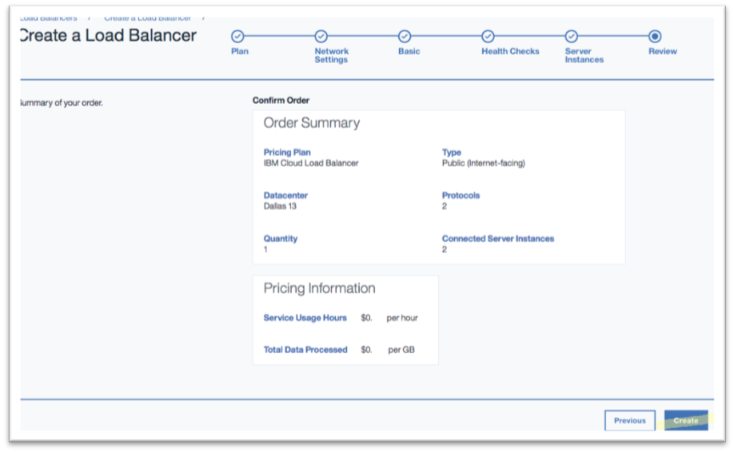

---

copyright:
  years: 2017, 2018
lastupdated: "2018-11-12"

keywords: order, load balancer

subcollection: loadbalancer-service

---

{:shortdesc: .shortdesc}
{:codeblock: .codeblock}
{:screen: .screen}
{:new_window: target="_blank"}
{:pre: .pre}
{:table: .aria-labeledby="caption"}
{:note: .note}
{:important: .important}

# Review and Place Your Order
{: #review-and-place-your-order}

Review the **Order Summary** and click **Create** to place your order.

The system now creates a service instance and takes you to the Load Balancers summary page, where you will see your new load balancer listed.

Your newly created load balancer may not immediately display in this list. After a few minutes, the new load balancer will display in a gray color, indicating its status is Offline. After another few minutes, the new load balancer will display green, indicating it is Online. You may need to refresh your screen to see these changes.
{: note}

## What's Next
{: #what-s-next-4}

[Monitor and manage your service performance](/docs/infrastructure/loadbalancer-service?topic=loadbalancer-service-monitoring-and-managing-your-service).
