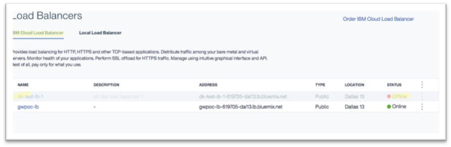

---

copyright:
  years: 2017, 2018
lastupdated: "2018-08-30"

---

{:shortdesc: .shortdesc}
{:codeblock: .codeblock}
{:screen: .screen}
{:new_window: target="_blank"}
{:pre: .pre}
{:table: .aria-labeledby="caption"}

# Review and place order
Review your **Order Summary** and click **Create** to place your order.

The system now creates a service instance for you and takes you to the Load Balancers summary page. Refresh your browser window  to see the entry for your new load balancer and its state change from offline to online.  

