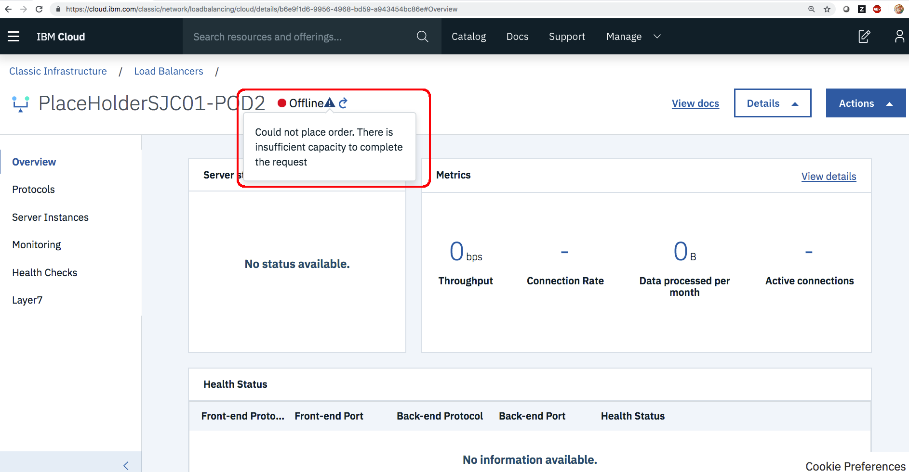

---

copyright:
  years: 2018
lastupdated: "2018-11-12"

keywords: troubleshooting, provisioning, question, problem

subcollection: loadbalancer-service

---

{:shortdesc: .shortdesc}
{:new_window: target="_blank_"}
{:codeblock: .codeblock}
{:pre: .pre}
{:screen: .screen}
{:tip: .tip}
{:download: .download}
{:note: .note}
{:important: .important}
{:support: data-reuse='support'}

# Load balancer provisioning troubleshooting
{: #load-balancer-provisioning-troubleshooting}

This topic provides information on common issues you may encounter while creating a new instance of {{site.data.keyword.loadbalancer_full}}.

## Insufficient IP addresses in your subnet
{: #insufficient-ip-addresses-in-your-subnet}
{: troubleshoot}
{: support}

{{site.data.keyword.loadbalancer_full}} requires at least two free IP addresses from its private subnet. In addition, if the load balancer is a public load balancer and the **IBM system pool** option is not used, then at least two free IP addresses are needed from your public subnet as well.

## Issues with firewalls on public and private VLANs
{: #issues-with-firewalls-on-public-and-private-vlans}
{: troubleshoot}
{: support}

Refer to the topic [IBM Cloud IP Range](/docs/hardware-firewall-dedicated?topic=hardware-firewall-dedicated-ibm-cloud-ip-ranges#ibm-cloud-ip-ranges) for information on allowing IP ranges through the firewall.

## Viewing load balancer error messages
{: #viewing-load-balancer-error-messages}
{: troubleshoot}
{: support}

To view error messages for your load balancer, perform the following procedure:

1. Click on the load balancer from the list page to view its details.
2. Mouseover the error symbol next to the load balancer's status.

If the load balancer is in an `ERROR` state, it cannot be recovered and must be deleted.
