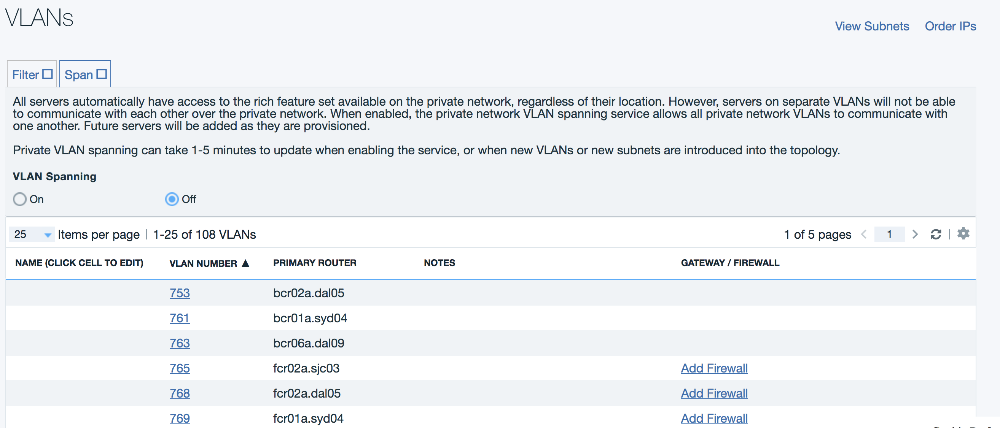

---

copyright:
  years: 2018
lastupdated: "2018-11-12"

---

{:shortdesc: .shortdesc}
{:new_window: target="_blank"}
{:codeblock: .codeblock}
{:pre: .pre}
{:screen: .screen}
{:tip: .tip}
{:download: .download}

# Load Balancer VLAN Spanning Troubleshooting
{: #load-balancer-vlan-spanning-troubleshooting}

This topic provides information on common issues you may encounter when the load balancer and the compute instances connected to the load balancer are in different subnets. VLAN Spanning must be enabled for the load balancer to communicate and forward requests to compute instances residing on a different subnet.

1. Login to the [Customer Portal ](https://control.softlayer.com){:new_window}, navigate to **Network > IP Management**, then click on **VLANs**.

2. Toggle **VLAN Spanning** to **On**.

This opens communication between the load balancer and its compute instances.